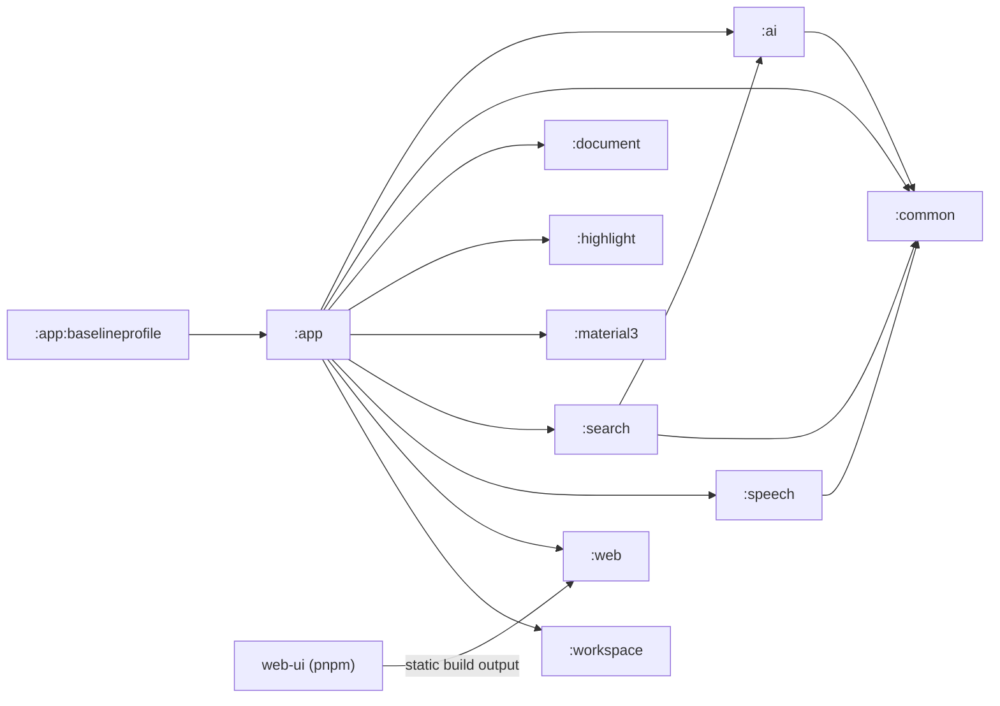

# RikkaHub 项目结构

本文档记录当前仓库的源码组织、构建关系与常见改动入口，供后续开发定位使用。
它覆盖受版本控制的主要源码和配置；`.gradle/`、各模块 `build/`、`.idea/` 等本地或构建产物不作为源码结构维护。

## 1. 项目概览

RikkaHub 是一个原生 Android LLM 聊天客户端。Android 主应用采用 Kotlin、Jetpack Compose、Koin、Room 和 DataStore；AI 协议、搜索、语音、文档、代码高亮和工作区被拆分为独立 Gradle 模块。项目还包含一个由 Android 内置 Ktor 服务托管的 React Web UI。

| 路径 | 类型 | 职责 | 主要内容或依赖关系 |
| --- | --- | --- | --- |
| `settings.gradle.kts` | Gradle 根设置 | 声明工程模块与仓库 | 注册所有 Android Gradle 模块，并引入 `build-logic` 约定插件 |
| `build.gradle.kts` | Gradle 根构建脚本 | 集中声明构建插件 | Android、Kotlin、KSP、Firebase、Baseline Profile 插件 |
| `gradle/libs.versions.toml` | 版本目录 | 统一第三方库与插件版本 | Android Gradle Plugin、Kotlin、Compose、Ktor、Room、Koin 等 |
| `build-logic/` | Gradle included build | 共享 Android 库构建约定 | `rikkahub.android.library` 和 `rikkahub.android.library.compose`；统一 SDK 版本、Java 17 与 Compose 配置 |
| `app/` | Android 应用模块 | APK 入口、主要业务和 Compose UI | 依赖全部 Android 功能模块；包名 `me.rerere.rikkahub` |
| `ai/` | Android 库模块 | AI SDK 抽象与流式协议实现 | OpenAI、Claude、Google/Vertex Provider；依赖 `common` |
| `common/` | Android 库模块 | 跨模块基础工具 | Android、缓存、HTTP、QuickJS 等公用能力 |
| `document/` | Android 库模块 | 文档文本解析 | PDF、DOCX、PPTX、EPUB 解析；含 MuPDF 封装与 ABI 原生库 |
| `highlight/` | Compose Android 库模块 | 代码语法高亮 | 高亮核心与多语言定义；`tools/` 用 highlight.js 生成测试金样 |
| `material3/` | Compose Android 库模块 | Material 色彩工具扩展 | 包含 `material-color-utilities` Git 子模块源码 |
| `search/` | Compose Android 库模块 | 搜索服务 SDK 与配置 UI | 多个搜索服务实现；依赖 `ai`、`common` |
| `speech/` | Compose Android 库模块 | TTS 与 ASR 能力 | TTS 控制器、模型与 Provider，以及 ASR Provider；依赖 `common` |
| `web/` | Android 库模块 | Android 内嵌 Web 服务器 | Ktor/CIO、静态资源托管、SSE；构建时调用 `web-ui` 并嵌入其产物 |
| `workspace/` | Android 库模块 | AI 工作区的隔离文件系统与终端 | PRoot shell、rootfs 安装/补丁、工作区管理；含 CMake 与 ABI 原生库 |
| `app/baselineprofile/` | Android 测试模块 | 性能基线配置与启动基准 | 以 `app` 为 target project，生成 Baseline Profile |
| `web-ui/` | 独立 TypeScript 前端 | Web 端聊天界面 | React 19、React Router 7、Tailwind、Zustand、React Query；产物复制到 `web/src/main/resources/static` |
| `trace-cli/` | Bun TypeScript CLI | 录制真实 Provider 的 SSE 轨迹 | 生成 `ai` 测试可回放的 `events.jsonl`；不记录请求头或密钥 |
| `locale-tui/` | Python Textual 工具 | Android 多语言资源维护 | 字符串浏览、缺失翻译、Dead Entry 检查与 AI 翻译 |
| `docs/` | 文档与项目素材 | README 图片、引用资料、赞助商素材及工程文档 | 本文档位于此目录 |
| `.github/` | GitHub 配置 | Issue 模板与自动化工作流 | 每日构建、Issue 模板校验 |
| `.agents/`、`.claude/` | 开发辅助配置 | 面向 AI 编程工具的本地约定与技能 | 不参与应用运行或 APK 打包 |
| `gradlew`、`gradlew.bat`、`gradle/wrapper/` | Gradle Wrapper | 固定 Gradle 运行环境 | Android 构建、测试、Lint 的统一入口 |

## 2. 模块依赖关系

以下关系以 Gradle 构建脚本中的项目依赖为准。箭头表示左侧模块依赖右侧模块。



| 模块 | 直接项目依赖 | 被谁直接组合 | 开发边界 |
| --- | --- | --- | --- |
| `app` | `ai`、`common`、`document`、`highlight`、`material3`、`search`、`speech`、`web`、`workspace` | `app:baselineprofile` | 产品功能编排、持久化、Android UI 和应用级服务 |
| `ai` | `common` | `app`、`search` | 只处理模型、消息、Provider、SSE 解码等协议层职责 |
| `common` | 无项目依赖 | `app`、`ai`、`search`、`speech` | 保持为稳定、低层的共享工具，不反向依赖业务模块 |
| `document` | 无项目依赖 | `app` | 文档格式解析与原生解析库 |
| `highlight` | 无项目依赖 | `app` | 高亮核心、语言定义和高亮金样测试 |
| `material3` | 无项目依赖 | `app` | 色彩工具扩展与上游子模块代码 |
| `search` | `ai`、`common` | `app` | 各搜索服务实现及其配置交互 |
| `speech` | `common` | `app` | ASR/TTS 抽象和 Provider 实现 |
| `web` | 无项目依赖 | `app` | 嵌入静态页面、启动 Ktor 服务的底层能力 |
| `workspace` | 无项目依赖 | `app` | 沙箱文件系统、rootfs 与 shell 执行能力 |
| `app:baselineprofile` | `app`（测试目标） | 无 | 性能回归测试，不承载业务代码 |

## 3. Android 主模块分层

`app` 是应用的唯一 Android 入口。`AndroidManifest.xml` 指定 `RikkaHubApp` 为 `Application`，以 `RouteActivity` 作为启动 Activity；应用启动时初始化 Koin、数据存储、工作区、通知和可选的内嵌 Web 服务。

| 路径 | 层级 | 主要职责 | 关键入口或内容 |
| --- | --- | --- | --- |
| `app/src/main/java/me/rerere/rikkahub/RikkaHubApp.kt` | 应用启动 | 初始化 Koin、QuickJS、通知、清理任务、工作区检查和 Web 服务 | `RikkaHubApp` |
| `app/src/main/java/me/rerere/rikkahub/RouteActivity.kt` | Android/导航入口 | 设置 Compose 主题和 Navigation 3 路由栈，处理分享与文本处理 Intent | `RouteActivity`、`Screen` 路由定义 |
| `app/src/main/java/me/rerere/rikkahub/di/` | 依赖注入 | 注册 App Scope、Room、网络客户端、Repository、ViewModel 与服务 | `AppModule.kt`、`DataSourceModule.kt`、`RepositoryModule.kt`、`ViewModelModule.kt` |
| `app/src/main/java/me/rerere/rikkahub/ui/` | 表现层 | Compose 页面、通用组件、主题、CompositionLocal、Hook 与 Modifier | `pages/` 为功能页面；`components/` 为可复用 UI |
| `app/src/main/java/me/rerere/rikkahub/ui/pages/chat/` | 核心功能页面 | 对话与生成交互 | 聊天流式输出、消息工具展示等 |
| `app/src/main/java/me/rerere/rikkahub/ui/pages/assistant/` | 配置页面 | Assistant 及其提示词、MCP、工具、记忆、请求设置 | `detail/` 下按配置域拆分 |
| `app/src/main/java/me/rerere/rikkahub/ui/pages/extensions/` | 扩展功能页面 | Prompt、快捷消息、技能和工作区 UI | `skills/`、`workspace/` 子目录 |
| `app/src/main/java/me/rerere/rikkahub/ui/pages/setting/` | 设置页面 | Provider、模型、搜索、语音、Web、主题、文件等配置 | 多个 `Setting*Page.kt` |
| `app/src/main/java/me/rerere/rikkahub/data/model/` | 领域模型 | Assistant、Conversation、Favorite、Folder 等可持久化或展示模型 | `Conversation` 用消息节点树支持分支对话 |
| `app/src/main/java/me/rerere/rikkahub/data/ai/` | 生成编排 | 请求拦截、生成处理、模板、消息转换、MCP 和本地工具 | `transformers/`、`mcp/`、`tools/` |
| `app/src/main/java/me/rerere/rikkahub/data/datastore/` | 本地设置 | DataStore 配置和迁移 | `SettingsStore` |
| `app/src/main/java/me/rerere/rikkahub/data/db/` | 本地数据库 | Room 数据库、实体、DAO、FTS 和迁移 | `entity/`、`dao/`、`fts/`、`migrations/` |
| `app/src/main/java/me/rerere/rikkahub/data/repository/` | 数据访问 | 对话、记忆、文件、收藏、媒体、文件夹和工作区仓储 | 连接数据源与 UI/服务层 |
| `app/src/main/java/me/rerere/rikkahub/data/sync/` | 数据同步 | 导入、S3、WebDAV 备份与同步 | `importer/`、`s3/`、`webdav/` |
| `app/src/main/java/me/rerere/rikkahub/service/` | Android 后台服务 | 生成会话、通知和前台 Web 服务器服务 | `ChatService`、`WebServerService` |
| `app/src/main/java/me/rerere/rikkahub/web/` | Web API 适配层 | 为内嵌 Web UI 提供会话、设置、文件和事件 API | `WebApiModule`、`routes/`、`dto/` |
| `app/src/main/res/` | Android 资源 | 多语言字符串、主题、图标、字体、XML 配置 | `values*` 表示各语言资源 |
| `app/src/main/assets/` | 打包资源 | Emoji、横幅、HTML、图标和词典 | `simple_dict/` 供消息全文检索使用 |

## 4. 功能模块内部结构

| 模块 | 主要源码目录 | 关键实现 | 何时进入该模块 |
| --- | --- | --- | --- |
| `ai` | `core/`、`provider/`、`registry/`、`ui/` | 模型/消息抽象、Provider Manager、OpenAI Chat/Responses、Claude、Google SSE 解码 | 新增或修正模型协议、流式事件、通用消息结构 |
| `common` | `android/`、`cache/`、`http/`、`js/` | Android 扩展、缓存、HTTP 组件、QuickJS 支持 | 可复用且不应依赖业务域的基础能力 |
| `document` | `me/rerere/document/` | `PdfParser`、`DocxParser`、`PptxParser`、`EpubParser` | 新增或调整附件文本提取 |
| `highlight` | `core/`、`languages/` | 高亮器和 Bash、Kotlin、Python、SQL、TypeScript 等语言定义 | 调整 Markdown 代码块显示或新增语言 |
| `material3` | `me/rerere/material3/`、`material-color-utilities/` | 主题色计算与 Material 色彩工具 | 调整动态配色或色彩工具；先确认子模块状态 |
| `search` | `me/rerere/search/` | Exa、Tavily、Brave、SearXNG、Zhipu 等搜索服务 | 新增搜索 Provider 或修正搜索请求/结果标准化 |
| `speech` | `me/rerere/asr/`、`me/rerere/tts/` | ASR Provider、TTS Manager/Controller/Model/Provider | 新增语音识别或合成服务 |
| `web` | `me/rerere/rikkahub/web/`、`resources/static/` | Ktor CIO 启动函数、CORS、压缩、SSE、SPA 静态资源托管 | 调整服务器底座、静态资源构建/嵌入方式 |
| `workspace` | `me/rerere/workspace/`、`src/main/cpp/` | 工作区生命周期、文件系统映射、rootfs、PRoot shell runner | 调整隔离文件、挂载或命令执行；注意 Android ABI 原生层 |

## 5. Web 端集成链路

| 环节 | 路径 | 作用 |
| --- | --- | --- |
| 前端页面 | `web-ui/app/routes/` | 当前含首页、会话详情和会话列表路由 |
| 前端状态与服务 | `web-ui/app/stores/`、`web-ui/app/services/` | 管理应用状态、聊天输入、设置和 API/SSE 通信 |
| 前端通用组件 | `web-ui/app/components/` | 输入、消息 Markdown、工作台和基础 UI 组件 |
| 前端构建 | `web-ui/package.json` | `pnpm run build` 执行 React Router 构建并运行 `copy.ts` |
| Android 构建接入 | `web/build.gradle.kts` 的 `buildWebUi` | `web` 模块 `preBuild` 依赖前端构建任务 |
| 资源打包 | `web/src/main/resources/static/` | 接收前端静态产物并随 APK 打包 |
| HTTP 托管 | `web/.../Entry.kt` | Ktor 提供静态 SPA、压缩、CORS 和 SSE 支持 |
| 业务 API | `app/.../web/routes/` | Android 侧实现会话、设置、文件、文件夹、事件和 AI 图标等接口 |

修改 Web 功能时，通常需要同步检查 `web-ui` 的类型/路由/状态层，以及 `app/.../web/routes/` 的 Android API 实现；仅修改 `web` 模块通常只涉及服务器或打包机制。

## 6. 配套开发工具与自动化

| 路径 | 运行环境 | 用途 | 常用命令 |
| --- | --- | --- | --- |
| `trace-cli/` | Bun + TypeScript | 录制可回放的 Provider SSE 轨迹，供 `ai` 模块测试 | `bun run trace -- traces.yml --list`、`bun test` |
| `locale-tui/` | Python 3.12+、Textual | 浏览、编辑、检查和翻译 Android 字符串资源 | `uv run python src/main.py` |
| `highlight/tools/` | Node.js | 从 highlight.js 生成语言高亮金样 | `npm run generate` |
| `.github/workflows/daily-build.yml` | GitHub Actions | 安装 pnpm/Node/JDK，构建前端与 Release APK，发布每日预发行版 | 定时或手动触发 |
| `.github/workflows/close-blank-issues.yml` | GitHub Actions | 自动关闭未按模板填写的 Issue | Issue 新建时触发 |

## 7. 常见改动定位表

| 开发目标 | 首要修改位置 | 通常还需检查 |
| --- | --- | --- |
| 新增模型供应商或修复流式协议 | `ai/.../provider/providers/` | `ProviderManager`、`ModelRegistry`、`app` 的 Provider 设置与生成编排 |
| 新增 Compose 页面 | `app/.../ui/pages/` | `RouteActivity.kt` 的 `Screen` 与 `entryProvider`、相关 ViewModel/Repository |
| 新增持久化数据 | `app/.../data/db/entity/`、`dao/` | `AppDatabase`、迁移、Repository、导入/导出或同步逻辑 |
| 新增消息处理能力 | `app/.../data/ai/transformers/` 或 `tools/` | 生成管线、Assistant 配置、流式可视化和结束处理 |
| 新增本地工具/MCP 功能 | `app/.../data/ai/tools/` 或 `mcp/` | 权限、文件管理、Assistant 配置和聊天工具展示 |
| 新增搜索或语音服务 | `search/` 或 `speech/` | `app` 中对应设置页面与服务初始化 |
| 新增文档格式支持 | `document/` | `DocumentAsPromptTransformer`、附件 UI 和文件类型判断 |
| 调整工作区终端或文件能力 | `workspace/` | `WorkspaceRepository`、工作区页面、本地工具和挂载安全性 |
| 修改 Web 端功能 | `web-ui/app/` | `app/.../web/routes/`、前端类型检查、`web` 构建产物嵌入 |
| 调整语言文案 | 各模块 `src/main/res/values*/strings.xml` | `locale-tui/` 配置与缺失翻译检查 |

## 8. 构建与验证入口

在仓库根目录执行：

```bash
./gradlew assembleDebug
./gradlew test
./gradlew lint
```

`web` 模块的 `preBuild` 会执行 `web-ui` 的 `pnpm run build`，因此 Android 构建前需要先在 `web-ui/` 安装依赖。应用构建还需要 `app/google-services.json`，详见根目录 README。

## 9. 维护规则

- 新增、移除或重命名 Gradle 模块时，同时更新第 1 节和第 2 节。
- 调整模块间项目依赖时，更新依赖图与“开发边界”表，避免说明与 `build.gradle.kts` 漂移。
- 改变 Web 构建或资源嵌入流程时，更新第 5 节。
- 新增跨团队使用的工具或 CI 工作流时，补充第 6 节。
