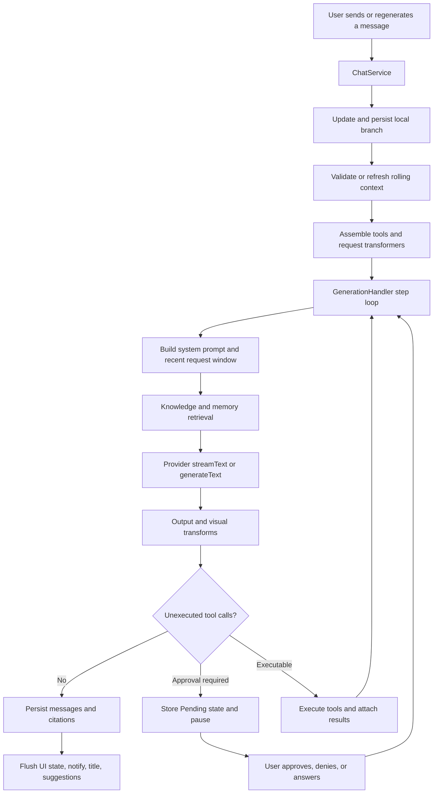

# Chat Request and Generation Architecture

[简体中文](chat-generation-pipeline.zh-CN.md) | English

This document describes how Rikkahub Revised turns a user action into a model
request, processes a streamed or non-streamed response, executes tools, and
persists the final conversation state. It reflects the Revised source tree and
is intended for maintainers who need to change generation behavior without
breaking context, retrieval, approval, or persistence guarantees.

## Architectural Boundary

The most important boundary is the distinction between local conversation
history and the request sent to a Provider:

- `Conversation.messageNodes` retains the complete local branch history.
- Rolling context may summarize a stable prefix for model input, but does not
  delete the visible local messages.
- A Provider receives the validated summary plus a recent message window. If a
  summary refresh fails, the fallback still limits the request to recent
  messages instead of sending the full history.
- Knowledge and memory retrieval add request-scoped context. Retrieved context
  is not treated as a replacement for the stored conversation.

## Main Components

| Component | Responsibility |
| --- | --- |
| `ChatService` | Owns user-facing generation orchestration, conversation state, rolling-summary preparation, tool registration, and completion side effects. |
| `ConversationSession` | Holds the in-memory state, active generation job, processing label, and reference count for one conversation. |
| `GenerationHandler` | Builds Provider requests, runs the multi-step model/tool loop, applies output processing, and associates knowledge citations. |
| `RollingContext.kt` | Plans summary updates, validates which message prefix a summary covers, estimates context size, and chooses the recent fallback window. |
| Input transformers | Modify the request-only message list before it reaches a Provider. |
| Output transformers | Normalize stored output, derive display-only output, and perform final post-processing. |
| Provider implementation | Converts normalized messages and generation parameters into the selected API protocol. |
| Conversation and knowledge repositories | Persist conversations, rolling summaries, knowledge data, memories, and response citations. |

## End-to-End Flow



## 1. Entry and Local State

`ChatService.sendMessage()` is the normal entry point.

1. It rejects an empty input.
2. It cancels the previous generation job for the same session and waits for
   that job to finish.
3. It completes any interrupted pending-tool state from the previous run.
4. It applies user-scope assistant regular-expression rules to text parts.
   Images, documents, and other non-text parts remain unchanged.
5. It appends a `USER` message node and saves the conversation before starting
   model generation.
6. When `answer` is enabled, it calls `handleMessageComplete()`.

Regeneration uses the same completion path with a selected message range. A
regenerated assistant branch can therefore use a shorter local branch without
mutating unrelated alternatives.

## 2. Rolling Context and Request Window

Before ordinary generation, `ChatService` calls
`prepareRollingContextForGeneration()`.

`RollingContextSummary` records both the summary text and the IDs of the exact
message prefix it covers. A stored summary is reused only when those IDs still
match the current branch. Editing, deleting, or switching branch messages
invalidates a mismatched summary automatically.

Compression planning follows these rules:

- The configured threshold defaults to 32,000 estimated tokens when an older
  disabled value is encountered.
- At least four messages are required before a summary can be planned.
- The recent window targets 55 percent of the configured threshold and keeps
  at least four recent messages.
- The window start moves backward to a user turn so tool output is not detached
  from the request that initiated it.
- A refreshed summary incorporates the previous valid summary and the newly
  covered messages, then stores the new prefix IDs with the conversation.

If automatic compression fails, generation continues with
`rollingContextWindowStartIndex()`. This fallback preserves full local history
but excludes the older portion from the Provider request. Manual compression
uses the same planner with a forced target and optional user instructions.

## 3. Tool and Capability Assembly

`ChatService` supplies application tools in this order:

1. External web-search tools when the selected model and settings require them.
2. Enabled local tools.
3. Recent-conversation tools when recent chat reference is enabled.
4. Workspace tools when the configured workspace shell is ready.
5. Enabled skill tools.
6. Connected MCP tools, renamed as `mcp__{serverName}__{toolName}`.

`GenerationHandler` then prepends enabled memory tools and knowledge-base tools.
For a model with tool-calling support, it also adds
`get_session_capabilities`, which reports the tools and retrieval modes
available in the current request.

When the model does not support tool calls, no tool definitions are sent. A
small capability block is added to the system context instead, so the model
does not claim that unavailable tools were executed.

## 4. System Context and Input Transformers

The request begins with a system message assembled from applicable sources:

1. The conversation-specific system prompt, when the assistant allows it;
   otherwise the assistant system prompt.
2. The non-tool capability block, if required.
3. The validated rolling summary.
4. Basic memory text when memory is enabled without memory RAG.
5. System prompts contributed by registered tools.

The request-only message list then passes through input transformers in this
exact order:

| Order | Transformer | Effect |
| --- | --- | --- |
| 1 | `TimeReminderTransformer` | Adds current time context when configured. |
| 2 | `PromptInjectionTransformer` | Applies mode and lorebook injections at their configured positions. |
| 3 | `PlaceholderTransformer` | Resolves supported prompt placeholders. |
| 4 | `DocumentAsPromptTransformer` | Converts compatible document attachments into prompt content. |
| 5 | `OcrTransformer` | Adds recognized text for image content when OCR is enabled. |
| 6 | `TemplateTransformer` | Renders message templates with the configured template engine. |
| 7 | `WorkspaceReminderTransformer` | Adds the active workspace path and related context. |
| 8 | `KnowledgeRetrievalTransformer` | Retrieves relevant chunks from bound RAG-enabled knowledge bases. |
| 9 | `MemoryRetrievalTransformer` | Retrieves relevant memories when memory RAG is enabled. |

Each transformer receives the previous transformer's output. These changes are
for the outgoing request and do not rewrite the complete local branch.

## 5. Retrieval and Citations

Knowledge retrieval uses the latest user message as its query. For bound and
enabled RAG knowledge bases, it attempts embedding similarity with the selected
embedding model and falls back to lexical matching when embeddings are
unavailable or fail. Up to six chunks are added to a delimited system-context
block.

Each selected chunk also becomes a `KnowledgeCitation` annotation. Citations
are copied only from context produced for the current request, attached to the
assistant response, and persisted by conversation ID and assistant message ID.
Knowledge tool results can contribute citations through the same normalized
annotation path.

Memory RAG follows a similar query flow. It selects the assistant-specific or
global memory scope, prefers compatible stored embeddings, falls back to
lexical matching, and adds up to six memories as context. Memory context is
explicitly informational rather than instructional.

## 6. Provider Invocation and Streaming

`GenerationHandler.generateInternal()` builds `TextGenerationParams` from the
selected model and assistant configuration, including temperature, top-p,
maximum output tokens, reasoning level, tools, custom headers, and custom body
entries.

- Streaming mode calls `Provider.streamText()` and merges chunks through
  `StreamChunkHandler`.
- Non-streaming mode calls `Provider.generateText()` and normalizes the single
  result through the same message model.
- Provider-level stream updates are coalesced at approximately 40 ms unless a
  chunk requires immediate display.
- `ChatService` publishes conversation state at approximately 83 ms intervals
  and force-publishes the final pending state on completion.

This throttling limits UI and persistence churn without dropping the final
response state.

## 7. Output Processing

Output processing has three distinct phases:

| Phase | API | Purpose |
| --- | --- | --- |
| Stored update | `transforms()` | Applies durable message normalization, including assistant output regex rules. |
| Display update | `visualTransforms()` | Produces display-only structure during generation, such as visible reasoning extracted from think tags. |
| Finalization | `onGenerationFinish()` | Completes end-of-generation work such as final think-tag handling and base64 image persistence. |

After finalization, the assistant message receives `finishedAt`, request
citations are persisted, and the complete current message list is emitted.

## 8. Tool Loop and Approval

Generation runs for at most 256 model/tool steps.

When a response contains unexecuted tool calls:

- A tool whose policy requires approval changes from `Auto` to `Pending`.
  Generation emits that state and pauses.
- `ChatService.handleToolApproval()` records `Approved`, `Denied`, or
  `Answered`. Generation resumes only after no pending tool remains.
- `Denied` produces a structured error result.
- `Answered` uses the user's supplied text as the tool result.
- `Auto` and `Approved` execute the registered tool implementation.

Tool results remain attached to the assistant message's tool parts instead of
creating a separate `TOOL` role message. After execution, citations are
extracted from compatible knowledge-tool results and the loop starts another
model step.

If workspace shell access is available and text output exceeds 32 KiB, the full
output is stored under `/tool_outputs/{toolCallId}.txt`; the message keeps a
4 KiB preview and instructions for reading the file. Cancellation exceptions
are propagated instead of being converted into tool errors.

## 9. Completion, Notifications, and Session Lifetime

When the generation flow completes or is cancelled, `ChatService`:

- flushes the last throttled message state;
- closes any unfinished reasoning state;
- updates the conversation timestamp;
- emits a generation-ended event used by notification handling.

On successful completion it saves the conversation, then launches title and
suggestion generation while holding a conversation reference.

`ConversationSession` keeps a per-conversation job and atomic reference count.
UI and long-lived API consumers acquire a reference while using the session. A
session with no references and no active generation is removed after a
five-second idle delay.

## Failure and Maintenance Invariants

Changes to this pipeline should preserve the following properties:

- Full local history is not silently deleted to satisfy a Provider context
  limit.
- Summary prefix IDs are validated before a stored summary is reused.
- Summary failure does not fall back to sending complete history.
- Request-only retrieval context does not overwrite persistent user messages.
- Approval-required tools never execute while still `Pending`.
- Cancellation propagates through tool execution and stream collection.
- The final throttled stream state is flushed before persistence and
  notification completion.
- Knowledge citations refer only to chunks retrieved for the active request or
  returned by an executed knowledge tool.

## Source Map

```text
app/src/main/java/me/rerere/rikkahub/
|-- service/
|   |-- ChatService.kt
|   `-- ConversationSession.kt
`-- data/ai/
    |-- GenerationHandler.kt
    |-- context/RollingContext.kt
    |-- transformers/
    |   |-- Transformer.kt
    |   |-- TimeReminderTransformer.kt
    |   |-- PromptInjectionTransformer.kt
    |   |-- PlaceholderTransformer.kt
    |   |-- DocumentAsPromptTransformer.kt
    |   |-- OcrTransformer.kt
    |   |-- TemplateTransformer.kt
    |   |-- WorkspaceReminderTransformer.kt
    |   |-- ThinkTagTransformer.kt
    |   |-- Base64ImageToLocalFileTransformer.kt
    |   `-- RegexOutputTransformer.kt
    |-- transforms/
    |   |-- KnowledgeRetrievalTransformer.kt
    |   `-- MemoryRetrievalTransformer.kt
    `-- tools/
```

Related persistence code is under `data/db`, `data/repository`, and
`data/knowledge`. Provider protocol implementations are in the top-level `ai`
module.
