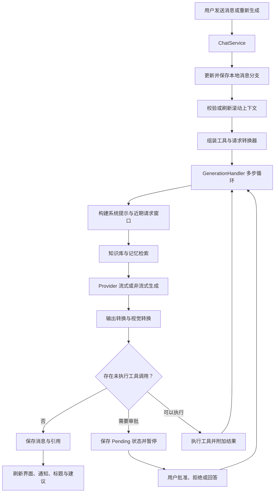

# 聊天请求与生成架构

简体中文 | [English](chat-generation-pipeline.en.md)

本文说明 Rikkahub Revised 如何把一次用户操作转换为模型请求，如何处理流式或
非流式响应、执行工具并保存最终会话状态。内容以 Revised 当前源码为准，面向需要
修改生成逻辑、同时保持上下文、检索、审批和持久化约束的维护者。

## 架构边界

这条链路最重要的边界，是区分本地会话历史与发送给 Provider 的请求内容：

- `Conversation.messageNodes` 保留当前分支的完整本地历史。
- 滚动上下文可以为模型输入摘要稳定的历史前缀，但不会删除用户可见的本地消息。
- Provider 只接收经过校验的摘要与近期消息窗口。如果摘要刷新失败，回退路径仍只会
  发送近期消息，不会重新发送完整历史。
- 知识库和记忆检索只为当前请求增加上下文，不会替代已保存的会话。

## 主要组件

| 组件 | 职责 |
| --- | --- |
| `ChatService` | 编排用户侧生成流程、会话状态、滚动摘要准备、工具注册和完成后的副作用。 |
| `ConversationSession` | 保存单个会话的内存状态、当前生成任务、处理提示与引用计数。 |
| `GenerationHandler` | 构建 Provider 请求，运行多轮模型/工具循环，处理输出并关联知识引用。 |
| `RollingContext.kt` | 规划摘要更新、校验摘要覆盖的消息前缀、估算上下文规模并选择近期回退窗口。 |
| 输入转换器 | 在消息到达 Provider 前修改仅用于本次请求的消息列表。 |
| 输出转换器 | 规范化持久化输出、生成仅用于展示的输出，并执行最终后处理。 |
| Provider 实现 | 将统一消息和生成参数转换为所选 API 协议。 |
| 会话与知识仓库 | 持久化会话、滚动摘要、知识数据、记忆和回复引用。 |

## 端到端流程



## 1. 入口与本地状态

普通发送入口是 `ChatService.sendMessage()`。

1. 空输入会直接被拒绝。
2. 同一会话原有的生成任务会先被取消，随后等待该任务结束。
3. 上一次运行中被中断的待处理工具状态会被补全。
4. 助手配置中作用于用户输入的正则规则只处理文本 Part；图片、文档等非文本 Part
   保持不变。
5. 新的 `USER` 消息节点会先写入并保存到会话，再开始模型生成。
6. 当 `answer` 启用时，流程进入 `handleMessageComplete()`。

重新生成同样复用补全流程，但可以指定消息范围。重新生成某个助手回复时，可以使用
较短的本地分支，而不会修改无关的备选分支。

## 2. 滚动上下文与请求窗口

普通生成前，`ChatService` 会调用
`prepareRollingContextForGeneration()`。

`RollingContextSummary` 同时记录摘要文本和它准确覆盖的消息 ID 前缀。只有这些 ID
仍与当前分支一致时，已有摘要才会被复用。编辑、删除消息或切换分支后，不匹配的摘要
会自动失效。

摘要规划遵循以下规则：

- 遇到旧配置中的禁用值时，压缩阈值按默认 32,000 个估算 Token 处理。
- 消息少于四条时不会生成摘要计划。
- 近期窗口的目标预算是压缩阈值的 55%，并至少保留四条近期消息。
- 窗口起点会向前移动到用户消息，避免工具输出与发起该调用的用户轮次分离。
- 刷新后的摘要会合并上一个有效摘要与新覆盖消息，并把新的前缀 ID 一起写回会话。

如果自动压缩失败，生成流程会使用 `rollingContextWindowStartIndex()` 继续执行。
这个回退路径仍保留完整本地历史，但会从 Provider 请求中排除较早部分。手动压缩使用
同一规划器，只是强制指定目标长度，并允许附加用户要求。

## 3. 工具与能力组装

`ChatService` 按以下顺序提供应用工具：

1. 当模型与设置需要外部搜索时加入网络搜索工具。
2. 加入助手启用的本地工具。
3. 启用近期对话引用时加入会话检索工具。
4. 配置的工作区 Shell 就绪时加入工作区工具。
5. 加入助手启用的 Skill 工具。
6. 加入已连接的 MCP 工具，并统一命名为
   `mcp__{serverName}__{toolName}`。

随后，`GenerationHandler` 会在这些工具前加入已启用的记忆工具和知识库工具。
如果模型支持工具调用，还会加入 `get_session_capabilities`，让模型了解当前请求中
实际可用的工具和检索模式。

如果模型不支持工具调用，请求不会发送任何工具定义。系统上下文会改为加入一段简短的
能力说明，避免模型声称执行了实际上不可用的工具。

## 4. 系统上下文与输入转换器

系统消息按实际可用内容依次组合：

1. 如果助手允许，优先使用会话专属系统提示；否则使用助手系统提示。
2. 必要时加入不支持工具调用的能力说明。
3. 加入通过前缀校验的滚动摘要。
4. 当记忆启用但记忆 RAG 关闭时，加入基础记忆文本。
5. 加入各注册工具提供的系统提示。

之后，仅用于本次请求的消息列表严格按以下顺序通过输入转换器：

| 顺序 | 转换器 | 作用 |
| --- | --- | --- |
| 1 | `TimeReminderTransformer` | 按配置加入当前时间上下文。 |
| 2 | `PromptInjectionTransformer` | 在指定位置应用 Mode 与 Lorebook 注入。 |
| 3 | `PlaceholderTransformer` | 解析支持的提示词占位符。 |
| 4 | `DocumentAsPromptTransformer` | 将兼容的文档附件转换为提示内容。 |
| 5 | `OcrTransformer` | 启用 OCR 时为图片内容补充识别文本。 |
| 6 | `TemplateTransformer` | 使用配置的模板引擎渲染消息。 |
| 7 | `WorkspaceReminderTransformer` | 加入当前工作区路径与相关上下文。 |
| 8 | `KnowledgeRetrievalTransformer` | 从助手绑定且启用 RAG 的知识库检索相关分块。 |
| 9 | `MemoryRetrievalTransformer` | 启用记忆 RAG 时检索相关记忆。 |

每个转换器接收上一个转换器的输出。这些变化只作用于待发送请求，不会重写完整的
本地消息分支。

## 5. 检索与引用

知识检索使用最近一条用户消息作为查询。对于助手绑定且启用 RAG 的知识库，系统优先
使用所选嵌入模型计算相似度；嵌入不可用或执行失败时回退到词法匹配。最多六个知识
分块会被加入带边界标签的系统上下文。

每个选中的分块还会生成 `KnowledgeCitation` 注解。只有本次请求检索出的引用会被复制
到助手回复，并按会话 ID 与助手消息 ID 持久化。知识工具返回的结果也可以通过同一
规范化流程贡献引用。

记忆 RAG 使用相似的查询链路。它会选择助手专属或全局记忆范围，优先比较兼容的已存
嵌入，失败时使用词法检索，并把最多六条记忆加入上下文。记忆上下文被明确标记为信息，
而不是应当执行的指令。

## 6. Provider 调用与流式处理

`GenerationHandler.generateInternal()` 根据所选模型与助手设置构建
`TextGenerationParams`，其中包括温度、Top-p、最大输出 Token、推理等级、工具、
自定义请求头和自定义请求体。

- 流式模式调用 `Provider.streamText()`，并由 `StreamChunkHandler` 合并增量块。
- 非流式模式调用 `Provider.generateText()`，随后把单次结果转换到同一消息模型。
- Provider 层的流式界面更新通常按约 40 ms 合并；要求立即显示的增量块不等待。
- `ChatService` 通常按约 83 ms 发布一次会话状态，并在结束时强制发布最后的待处理状态。

两级节流用于减少界面与持久化抖动，同时保证最终回复不会因节流而丢失。

## 7. 输出处理

输出处理分为三个目的不同的阶段：

| 阶段 | API | 用途 |
| --- | --- | --- |
| 存储更新 | `transforms()` | 执行需要持久化的消息规范化，包括助手输出正则规则。 |
| 展示更新 | `visualTransforms()` | 在生成期间构造只用于展示的结构，例如从 think 标签提取可见推理。 |
| 最终处理 | `onGenerationFinish()` | 完成 think 标签收尾、Base64 图片落盘等结束处理。 |

最终处理后，助手消息会写入 `finishedAt`，本次请求的引用会被持久化，随后发出完整的
当前消息列表。

## 8. 工具循环与审批

一次生成最多运行 256 个模型/工具步骤。

当回复包含尚未执行的工具调用时：

- 策略要求审批的工具会从 `Auto` 转为 `Pending`。系统发出该状态并暂停生成。
- `ChatService.handleToolApproval()` 写入 `Approved`、`Denied` 或 `Answered`。
  只有不存在待处理工具时才恢复生成。
- `Denied` 产生结构化错误结果。
- `Answered` 直接把用户提供的文本作为工具结果。
- `Auto` 与 `Approved` 会执行已注册的工具实现。

工具结果保留在助手消息的 Tool Part 中，不额外创建 `TOOL` 角色消息。执行完成后，
系统会从兼容的知识工具结果中提取引用，再开始下一轮模型步骤。

如果工作区 Shell 可用且文本输出超过 32 KiB，完整输出会保存到
`/tool_outputs/{toolCallId}.txt`；消息中保留 4 KiB 预览和文件读取说明。
取消异常会继续向上传播，不会被包装成普通工具错误。

## 9. 完成处理、通知与会话生命周期

生成流完成或被取消时，`ChatService` 会：

- 刷新最后一份受节流控制的消息状态；
- 结束仍未关闭的推理状态；
- 更新会话时间；
- 发出生成结束事件，交给通知逻辑处理。

成功完成后，会话会再次保存，并在持有会话引用的情况下启动标题和建议生成。

`ConversationSession` 为每个会话维护一个生成任务和原子引用计数。界面或长连接 API
使用会话期间会持有引用。没有引用且没有生成任务的会话会在五秒空闲延迟后从内存移除。

## 失败处理与维护约束

修改这条链路时，应继续满足以下约束：

- 不得为了满足 Provider 上下文限制而静默删除完整本地历史。
- 复用滚动摘要前必须校验它覆盖的消息 ID 前缀。
- 摘要失败时不得回退为发送完整历史。
- 仅用于请求的检索上下文不得覆盖持久化用户消息。
- 需要审批的工具在 `Pending` 状态下不得执行。
- 取消必须穿过工具执行与流收集过程继续传播。
- 在保存和发出完成通知前，必须刷新最后一份受节流控制的流式状态。
- 知识引用只能来自当前请求实际检索的分块，或已执行知识工具返回的结果。

## 源码索引

```text
app/src/main/java/me/rerere/rikkahub/
|-- service/
|   |-- ChatService.kt
|   `-- ConversationSession.kt
`-- data/ai/
    |-- GenerationHandler.kt
    |-- context/RollingContext.kt
    |-- transformers/
    |   |-- Transformer.kt
    |   |-- TimeReminderTransformer.kt
    |   |-- PromptInjectionTransformer.kt
    |   |-- PlaceholderTransformer.kt
    |   |-- DocumentAsPromptTransformer.kt
    |   |-- OcrTransformer.kt
    |   |-- TemplateTransformer.kt
    |   |-- WorkspaceReminderTransformer.kt
    |   |-- ThinkTagTransformer.kt
    |   |-- Base64ImageToLocalFileTransformer.kt
    |   `-- RegexOutputTransformer.kt
    |-- transforms/
    |   |-- KnowledgeRetrievalTransformer.kt
    |   `-- MemoryRetrievalTransformer.kt
    `-- tools/
```

相关持久化代码位于 `data/db`、`data/repository` 和 `data/knowledge`。
Provider 协议实现在顶层 `ai` 模块中。
