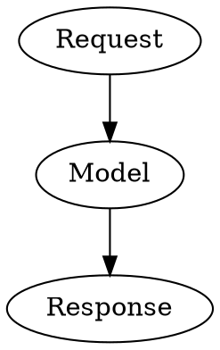

# 渲染组件清单与 SVG 审查记录

核对日期：2026-09-09。以下是代码中已经接入的渲染能力，并非可由用户自行安装的插件商店。

## 当前已有能力

| 能力 | 当前实现 | 入口 / 输入与边界 |
| --- | --- | --- |
| Markdown、表格、任务列表、引用与基础 HTML | JetBrains Markdown、Jsoup、Compose 原生组件 | 普通聊天正文；表格等复用富内容表面 |
| 流程图、时序图、思维导图等 | 本地 Mermaid 10.9.8 | `mermaid` 代码块；支持的图形语法受打包版本限制 |
| 折线、柱状、雷达、蜡烛、散点等图表 | 本地 Apache ECharts 5.5.0 | `echarts` / `chart`；也可识别特定 JSON/JS 配置；这些图表不是各自独立的插件 |
| 地理图与 GeoJSON | 本地 Leaflet 1.9.4；ECharts 也有地图能力 | `leaflet` / `map` / `geojson`；默认本地世界轮廓底图，无需联网，不含街道。可显式指定在线 `tileUrl`，失败回退离线概览；`basemap: false` 关闭底图 |
| ABC 五线谱 | 本地 ABCJS 6.2.2 | `abc` / `abcjs`；目前主要是乐谱绘制 |
| 简谱 | 项目自研 SVG 渲染器 | `jianpu` / `numbered` / `numbered-notation` / `简谱` 等别名 |
| 语法铁路图 | 本地 railroad-diagrams 官方提交 `736dec7`，加项目内 EBNF / 构造语法解析器 | `railroad` / `railroad-diagram` / `grammar` / `ebnf`；支持受限 Diagram 构造语法及 Stack 多行顺序，不执行任意 JS |
| SVG 与 HTML 预览 | Android WebView；SVG 图片文件另由 Coil SVG 解码 | `svg` / `html`，完整 XML 中的 SVG，以及未包裹代码块的 SVG；原始 SVG 按整个文档处理 |
| LaTeX 数学公式 | 聊天内 JLaTeXMath Android 1.5；整条消息网页预览使用 KaTeX 0.16.8 | 行内/块级公式；网页预览另加载 mhchem 化学公式扩展，不能等同于原生聊天支持全部宏 |
| 代码语法高亮与 Diff | 项目 Kotlin 高亮器（移植 highlight.js 语法）与 Compose DiffView | 多语言代码块、diff/patch 等；符合结构的独立统一 Diff 可识别 |
| 图片、GIF 与 SVG 图片文件 | Coil 3.5.0 及 GIF/SVG 解码器 | 图片附件、Markdown 图片与预览；SVG 文件解码的能力边界与 WebView 不完全相同 |

整条消息的网页预览另有 `mark.html`：已改为本地 markdown-it 14.0.0、KaTeX 0.16.8 与 mhchem、任务列表插件、highlight.js 11.9.0，并复用聊天内的 Mermaid 10.9.8。KaTeX 字体也已打包，预览自身不再依赖 CDN 或在线 ESM。列表里的“本地”是指渲染库和随包字体，并不表示模型引用的远程图片、其他字体、地图瓦片也已离线保存。

## 本次 SVG 审查与修复

参考材料为用户提供的导出 PNG，没有该图对应的完整原始 SVG。因此以实际代码缺陷及包含对应特征的重建样例进行验证，不把截图中的模型自述当作兼容性测试结果。

1. **原始 SVG 被拆解。** Markdown 会继续解释 SVG 内的空行与缩进；HTML 原生渲染的通用分支又会递归显示子节点文字。现在在 Markdown / 公式预处理前将完整 SVG 编码为独立占位节点，在展示时恢复原文交给图形渲染器。保留 `<defs>`、`linearGradient`、`filter`、大小写与嵌套 SVG。未闭合片段保持待完成状态，代码块及行内代码不被二次提取。
2. **坐标被强行改写。** 旧预览无条件用 getBBox 合并重设 viewBox，并对所有嵌套 SVG 应用统一 CSS。现在保留有效的原始 viewBox，只对根 SVG 做响应式缩放；缺少 viewBox 时先使用明确宽高，最后才以内容边界推导。
3. **导出过早截图。** 原先固定等待 100ms，无法保证 Markdown、WebView、字体和图片完成。新增导出就绪追踪，等待图形的完成信号与 WebView 视觉状态回调后截图。发生渲染错误或超时会提示并停止；取消和失败也移除临时视图。动画在导出时取静态帧。
4. **列表内图形退化为文本。** HTML 列表现在将 SVG 占位、代码块等作为块级内容分派，避免被行内文字分组吞掉。

## 验证

- QA Kotlin 编译、JVM SVG/图形识别/导出就绪回归。
- `RawSvgTest` 生成 `app/build/reports/svg-regressions` 样例，`node scripts/verify-svg-renderer.cjs` 通过 Playwright + Edge 检查根/嵌套坐标、渐变像素、滤镜与动画标签，并生成截图。
- `SvgBitmapExportTest` 是 Android 位图导出测试，等待延迟 SVG 并检查红色像素；编译通过不等于已在设备运行。
- SVG 滤镜、WebView 软件画布导出及长图内存仍需 Android 真机复测。导出仍有原有最大尺寸范围，超长对话后续应考虑分页输出。

## 后续接入建议

下表为之前的计划，所列五类已在本轮接入；具体入口、范围与限制见下方“新增组件使用”。

| 优先级 | 组件 | 新增价值 | 接入前需要处理 |
| --- | --- | --- | --- |
| 1 | WaveDrom | 数字电路时序图、寄存器位域图，与现有 Mermaid 时序图用途不同 | 限定输入为声明式数据，复用 SVG 展示、缩放和导出就绪机制 |
| 2 | SmilesDrawer | 从 SMILES 绘制二维分子结构，补足化学公式只能排版的问题 | 校验分子输入、深浅主题与原子文字可读性 |
| 3 | Graphviz / Viz.js | DOT 自动布局，适合复杂依赖图、网络拓扑 | WASM 体积、工作线程、执行超时、复杂图节点上限 |
| 4 | OpenSheetMusicDisplay | MusicXML / MXL 乐谱导入，覆盖 ABC 以外的乐谱来源 | 附件读取、压缩文件限额、多页谱面与内存管理 |
| 5 | Vega-Lite / Vega | 声明式数据可视化及组合图表 | 与 ECharts 有重叠，应先确定需求；限制外部数据加载和复杂转换 |

Markmap 与已有 Mermaid 思维导图重叠，Plotly/Three.js 等较重的 3D 能力可放在明确有需求后考虑。

## 新增组件使用

| 围栏标签 | 库与范围 | 主要限制 |
| --- | --- | --- |
| `wavedrom` / `waveform` | WaveDrom 3.1.0：WaveJSON 波形、寄存器位域和逻辑图，默认皮肤已打包 | 输入 JSON 数据，最多 32000 字符 |
| `dot` / `graphviz` | @hpcc-js/wasm-graphviz 1.29.0，内嵌 Graphviz 16.1.0 | 在模块 Worker 中执行 DOT 布局；需要 WebAssembly/模块 Worker，15 秒超时终止；不支持时提示更新系统 WebView |
| `vega` / `vega-lite` | Vega 6.4.0、Vega-Lite 6.4.3、Vega Embed 7.2.0 | 数据使用 `data.values`；禁用外部数据加载，预览不提供打开在线编辑器按钮 |
| `smiles` / `molecule` | SmilesDrawer 2.4.1，SVG 分子结构 | 单个 SMILES，不把 MOL 文件误当作 SMILES；最多 4000 字符 |
| `musicxml` / `music-xml` | OpenSheetMusicDisplay 2.1.2 | 完整 `score-partwise` XML，最多 200 小节；压缩 MXL/文件导入和播放本次未接入 |

这五类使用统一的聊天预览、源码切换、全屏缩放与导出等待机制。
图形内部采用清晰的浅色纸面，防止原生谱面、分子符号与复杂壁纸发生低对比度。
渲染库、WaveDrom 皮肤、Vega 依赖和 Graphviz WASM 已本地打包。
jQuery 3.6.4 作为用户提供的通用脚本保留，不单独提供渲染入口，也不注入这些预览。
输入超过通用 128 KiB 限制时保留源码展示。

```wavedrom
{"signal":[{"name":"clock","wave":"p....."},{"name":"data","wave":"x.345x","data":["A","B","C"]}]}
```



```vega-lite
{"mark":"bar","data":{"values":[{"name":"A","value":2},{"name":"B","value":4}]},"encoding":{"x":{"field":"name","type":"nominal"},"y":{"field":"value","type":"quantitative"}}}
```

```smiles
CC(=O)Oc1ccccc1C(=O)O
```

## GitHub 徽章图

- Markdown 图片、链接包裹的图片、引用式链接以及 HTML `<a></a>` 使用同一图片链路。HTML 的像素宽高可指定大小，相邻徽章会换行排列。
- Shields.io、Badgen、GitHub Actions 的徽章地址及已知尺寸的小型条状图片保持紧凑尺寸；SVG 使用未重复乘屏幕密度的 CSS 尺寸，保留矢量绘制，预览放大不依赖低分辨率缩略图。
- 徽章保持原色与方形边缘，不套用普通照片的大圆角。点击带链接徽章打开目标网址，长按放大；无链接图片点击直接预览。
- 徽章加载失败显示替代文字；预览使用稳定深色衬底，保存时将 SVG 正确绘制为 PNG，失败会报错，不提示虚假成功。
- 徽章依然需要首次联网获取，库离线打包并不等于任意远程徽章可以在离线首次显示。

`AdditionalRendererTest` 覆盖入口识别和徽章策略，`verify-additional-renderers.cjs` 使用项目内置库在浏览器中检查渲染及错误路径；`BadgeDecoderTest` 提供 Android SVG 尺寸和预览像素测试，须在设备上执行。只编译此用例不等于已完成真机验证。
